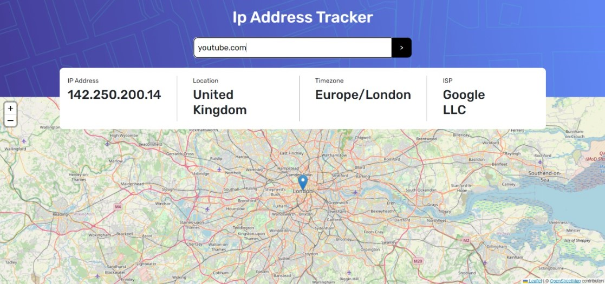

# Frontend Mentor - IP address tracker solution

This is a solution to the [IP address tracker challenge on Frontend Mentor](https://www.frontendmentor.io/challenges/ip-address-tracker-I8-0yYAH0). Frontend Mentor challenges help you improve your coding skills by building realistic projects. 

## Table of contents

- [Overview](#overview)
  - [The challenge](#the-challenge)
  - [Screenshot](#screenshot)
  - [Links](#links)
- [My process](#my-process)
  - [Built with](#built-with)
  - [What I learned](#what-i-learned)
  - [Useful resources](#useful-resources)
- [Author](#author)

## Overview

### The challenge

Users should be able to:

- View the optimal layout for each page depending on their device's screen size
- See hover states for all interactive elements on the page
- See their own IP address on the map on the initial page load
- Search for any IP addresses or domains and see the key information and location

### Screenshot

### Links

- Solution URL: [Github repo](https://github.com/8xMohab/front-end-mentor-challenges/tree/ip-address-tracker)
- Live Site URL: [Github Pages](https://8xmohab.github.io/ip-address-tracker)

## My process
  I created the project files then created 3 components, one for the form and sending get request to get info
  about the ip that the user gives with initial value of the user's current ip, the second component for displaying
  the ip info in the card, last one for displaying the map with the user's ip coordinates .
  (the map is created with react-leaflet)
### Built with

- [React](https://reactjs.org/) - JS library
- SASS
- Mobile-first workflow
- react-leaflets
- openstreetmap
- ip-api.com

### What I learned

  -Working with maps apis (google maps, openlayers, leaflet (what i finally used))

### Useful resources

- [Leaflet](https://leafletjs.com/) - Helped me with rendering maps in the UI
- [IP-API](https://ip-api.com/) - Helped me with getting info about an ip

## Author

- Frontend Mentor - [@8xMohab](https://www.frontendmentor.io/profile/8xMohab)
- Twitter - [@8xMohab](https://twitter.com/8xMohab)
